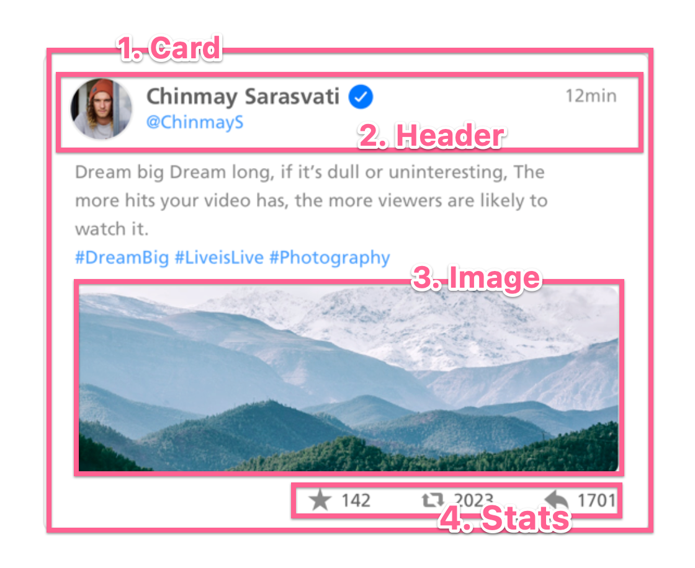
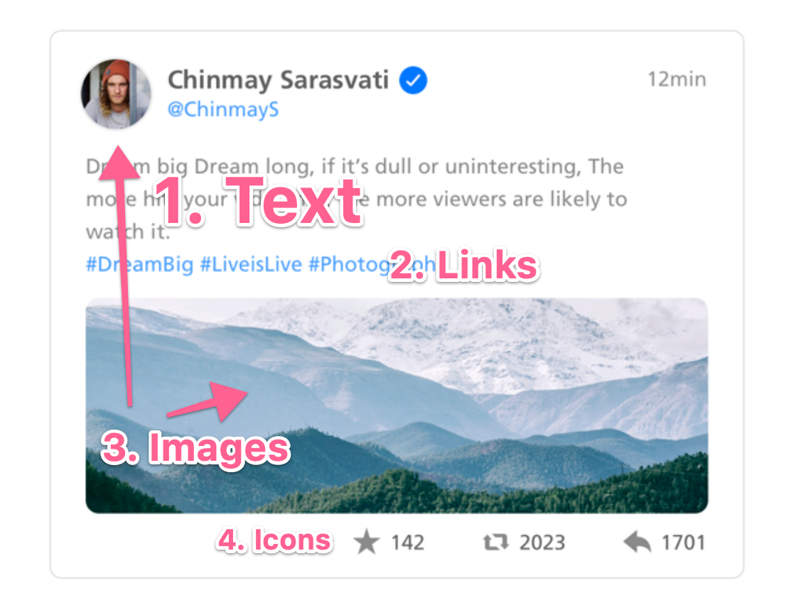
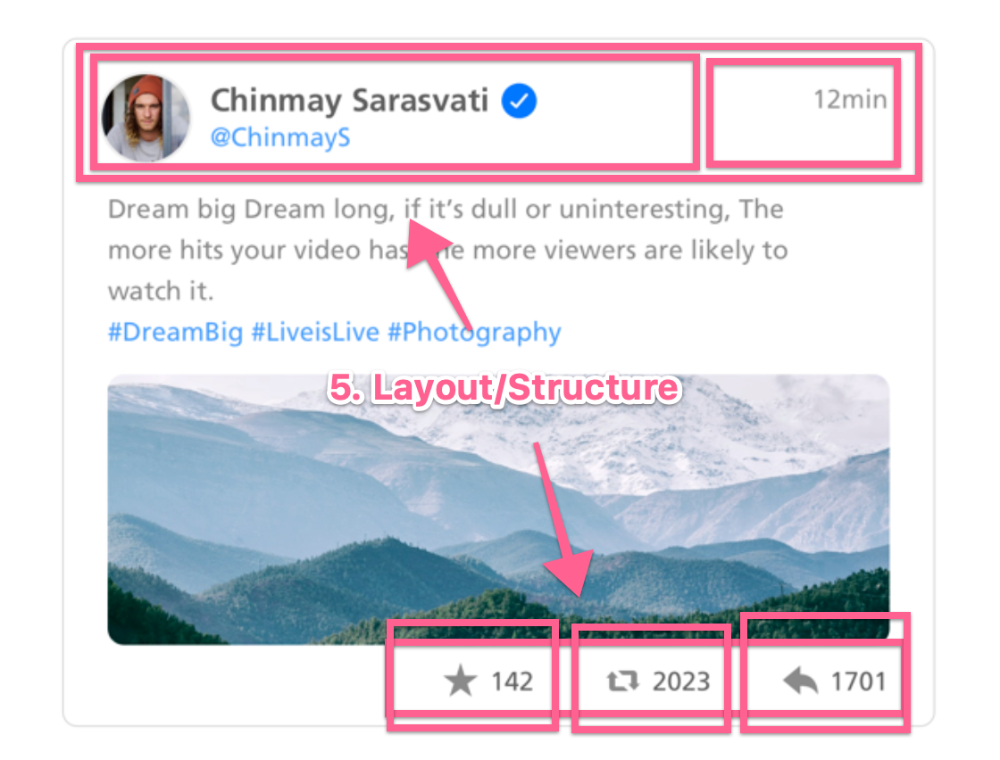
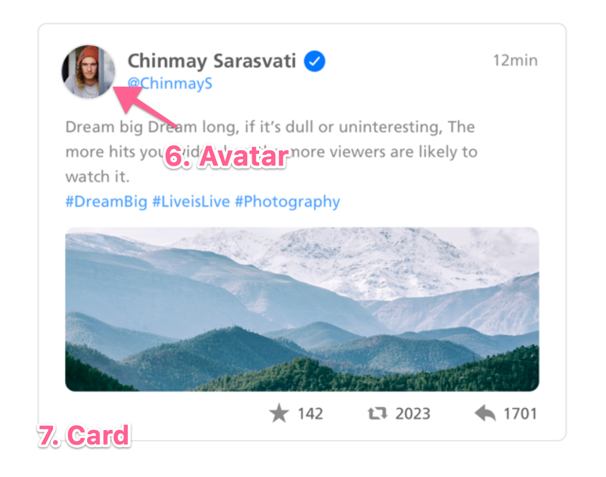

# Inside Out Design Pattern

"Inside Out" is a design pattern that focuses on building all of the smallest bits first, composing them together as you work your way outward.

This is helpful when it comes to constructing UI elements, which often has complex interactions and state.

By working on the smallest bits first, you're able to:

- Create some sort of development/test environment where the bits can be worked on in isolatation
- Think through and implement edge cases
- Simplify the responsibilities and logic

## Outside In

As front-enders, we already do a good job of scoping chunks of work and figuring out the requirements and dependencies. However, most front-enders don't go nearly as deep enough.

For our example, let's take this random (unsolicated) Twitter card redesign:


Look at it for 10-20 seonds. Try to break down the various chunks of work. Seriously! Try it.

...

Ready? Great! For most folks, the chunking may look something like this:



This is great! But this is **only the start**.

If you notice the numbering, we're starting from the biggest/most outer thing first, than working inward.

**This is the opposite of "Inside Out" (aka. Outside In)**.

This is the way folks have been thinking about and building stuff for years.

When you approach things in this manner, the tiny implementation details and requirements of the smaller (often more complicated) bits get pushed off to the side. A kind of, "I'll deal with this later..." situation.

When that "later" comes, you'll most likely experience a wall of hurt. Where things that you thought were easy, turned out to be hard. Where 1 edge case suddenly became 7, and you have no idea how to stich the various bits together.

This is the problem of the traditional "Outside In"

## Going Deeper

Now that we know what **not** to try, let's try this again.

Take a look at the UI design for 10-20 seconds, and break things down. Rmember, the one we had in the first example wasn't bad. It just wasn't complete.


...

Ready?

To approach this with an "Inside Out" perspective, we may start with something like this:



Wow. R U serious? That's granualer.

Welp, that's the point!

We start off by **identifying** the smallest pieces and **common elements**. In this case, it's (literally) text.

In the design, Text is used in 7 places, with 4 different variations:

1. Title
2. Body
3. Links
4. Social share links (which may be links)

Does your application/environment have text sorted out? Can it take care of all of our use cases?

Yes? Great! Then we can move onto #2, Links.

We took care of all the things we needed to at the base layer. We'll use that base layer as the foundation to construct the next thing.

Links are build on top of text. With this, we're seeing **composition** come into play:

```
Text -> Links
```

After you've taken care of 1, 2, 3, 4, you should have a collection of rock-solid, well thoughtout components, that you can use to construct your larger pieces **with confidence**.



For our next step, we've identified some (invisible) lower-level common elements for our design - layout and structure.

Your Text, Icons, and Images, have to live somewhere (somehow). Now would be a good time to figure that out!

Once you have that done, we can expand, taking care of the remaining (larger) chunks:



## Building in Parallel

Identifying this (granular) pieces forces you to think about dependencies and relationships. In most cases, you'll have work that don't necessarily depend on each other.

In our example, the chunks of work looks something like this:

1. Text/Links
2. Icons
3. Images/Avatar/Preview
4. Layout/Structure
5. Card

That means, these various bits of work **can be done in parallel**. They just need to be assembled after the fact to complete the project.

## Reusability

Creating a component just for Text? Or Links? That feels over the top.

On the surface, perhaps. But here's the thing... Once you have these base component constructed, you can reuse them indefinitely and never have to think about all the edge cases again.

That's the beauty of "Inside Out" design.

The only time you'd need to touch these various bits would typically be:

- Adding features
- Accounting for a new/missed edge-case
- Changing behaviour/styles

## TLDR

Examine your project and dive in. Start with the smallest/common elements first. Make them perfect. Use them as building blocks to construct your larger pieces as you work your way out.
